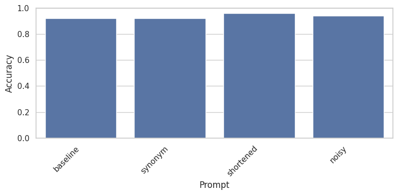
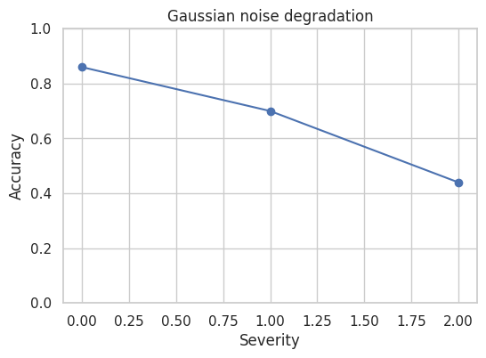
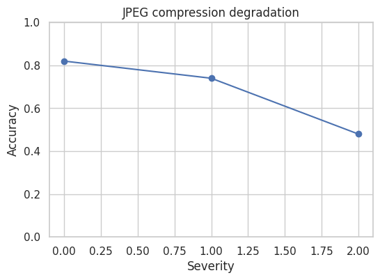

# Results — CLIP Robustness Analysis (compact)

## Experimental setup
- Model: CLIP `ViT-B/32` (zero-shot) loaded via the OpenAI `clip` package.
- Data: small CIFAR-10 subset (first 5 classes: airplane, automobile, bird, cat, deer), ≤50 images (10 per class).
- Execution: CPU-only inference; constrained runs for fast, reproducible checks.
- Prompt variants: baseline, synonym replacement, shortened, noisy.
- Corruptions: Gaussian noise and JPEG compression at three severities (light / medium / strong).

## Key quantitative findings
- Prompt robustness (50-image run):
  - Baseline accuracy: **0.920**
  - Synonym prompt: **0.920** (no drop)
  - Shortened prompt: **0.960** (improvement)
  - Noisy prompt: **0.940** (slight improvement)

  

- Image corruption (accuracy by severity):
  - Gaussian noise (light / medium / strong): **[0.86, 0.70, 0.44]**
  - JPEG compression (light / medium / strong): **[0.82, 0.74, 0.48]**

  

  

- Example relative impacts (approx., same small-sample run):
  - Baseline ≈ 0.92 → Gaussian strong ≈ 0.44 (≈52% relative drop)
  - Baseline ≈ 0.92 → JPEG strong ≈ 0.48 (≈48% relative drop)

## Observed failure modes
- High-magnitude Gaussian noise and strong JPEG compression frequently render low-resolution CIFAR images visually degraded, causing large accuracy drops.
- Prompt paraphrases (synonyms / punctuation) did not systematically degrade performance on this sample; shortened prompts sometimes helped. This suggests CLIP's text embedding mapping can be robust to simple paraphrases, but results are sample-dependent.
- Failure examples saved: `results/full_small/gauss_<severity>_fail_*.png` and `results/full_small/jpeg_<severity>_fail_*.png` (up to 5 per severity).

## Interpretation & limitations
- These results are a compact, illustrative check rather than a statistically powered evaluation. The small sample (≤50 images) and CPU-only evaluation limit generality.
- Strong corruptions that severely alter low-resolution images are expected to produce large drops — this confirms the corruption pipeline and CLIP's sensitivity on tiny images.
- No adversarial optimization or large-domain shifts were performed; follow-up studies should expand datasets, run on GPU for scale, and perform statistical replication.

## Reproducibility notes
- Re-run the constrained experiments with:

  ```bash
  PYTHONPATH=. python experiments/run_small_experiments.py
  ```

- Outputs are stored under `results/full_small/` (figures and failure examples). Model weights are downloaded on first `clip.load(...)` call and cached by the CLIP package.

---
For more details and code, see the repository `README.md` and the experiment drivers under `experiments/`.
